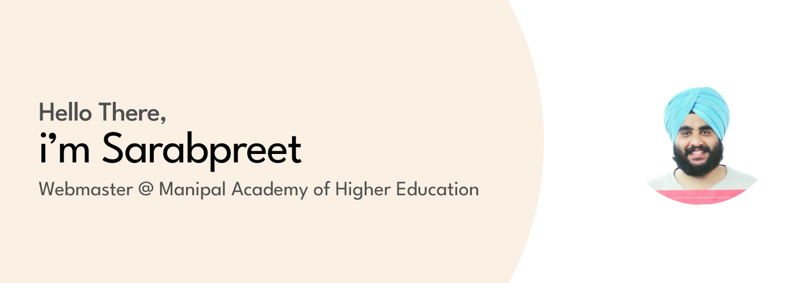

## Hello There, I'm Sarabpreet👳 

- Webmaster at [Manipal Academy of Higher Education](https://manipal.edu/)
- Founder [Code For Jharkhand](https://github.com/CodeForJharkhand)
- Former Full Stack Dev at [LocalSay](https://localsay.in/)
- Visit my [Website](https://sarabpreet.dev/)
- [Peerlist](https://peerlist.io/sarabpreet)
- [Bento](https://bento.me/sarabpreet)
- Follow me on [Twitter](https://twitter.com/saarabpreet)
## 👇 stacks i've worked with  

                              

## 👇 Stats

